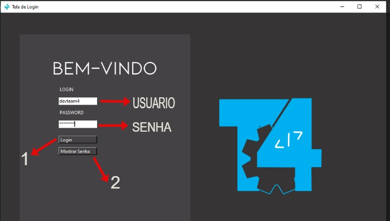
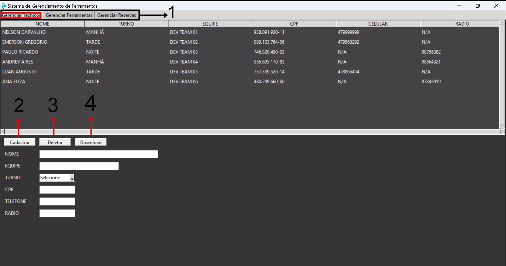
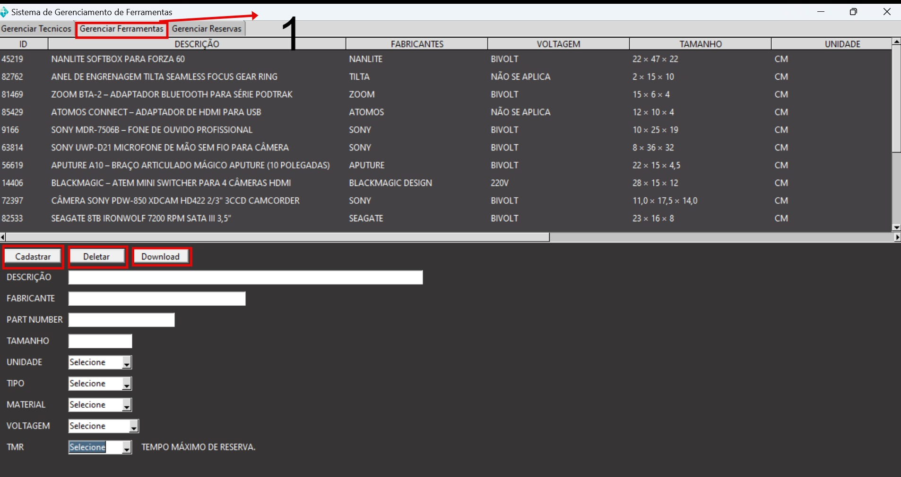
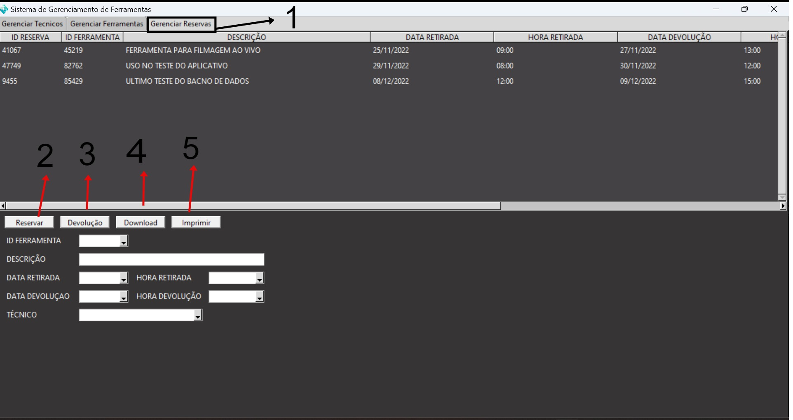

<!-- PROJECT LOGO -->

   
    <h1 align="center">FACULDADE ESTÁCIO</h1>
     

 

* DESENVOLVIMENTO FULL STACK- TURMA 9001- 2022.3
* PROJETO INTEGRADOR - MUNDO 01
* DISCIPLINA: RPG0007 - PROJETANDO UMA APLICAÇÃO DESKTOP
* MISSÃO CERTIFICAÇÃO – PROGRAMADOR RAIZ

 <h1 align="center"> PROJETO </h1>
 

 <h2> :clipboard: Objetivo da Aplicação </h2>

> Desenvolver uma aplicação para gerenciamento de ferramentas em um ambiente de produção de conteúdo audiovisual de
> grande porte.

<h2> Contexto </h2>

> Diferentes equipamentos com diversas necessidades de manutenção.
> Equipes de manutenção trabalham em turnos.
> Necessidades de diversas ferramentas específicas e com valores elevados.
> Ferramentas precisam estar em bom estado de conservação e aferidas conforme as normas e padrões do fabricantes.
> Ferramentas com diversas características técnicas que indicam para qual uso específico elas se aplicam.
> A correta reserva da ferramenta antes da execução do trabalho é fator crítico de sucesso.

<h2> Descrição do Processo </h2>

> Local onde as ferramentas ficam armazenadas chama-se “Central de Ferramentaria”.
> As ferramentas precisam ser reservadas com, no mínimo, 24 horas de antecedência.
> Solicitação de reserva são enviadas por endereço eletrônico para o responsável pela Central.
> No momento da reserva deve-se informar: Data e Hora da Retirada e da Devolução.
> Reservas precisam ficar associadas ao técnico responsável pela sua retirada.
> Uma ferramenta só pode ser reservada se ela estiver disponível na data e hora da retirada, ou seja, não pode estar
  reservada por outro técnico no momento da retirada.
> O responsável pela central controla as devoluções para garantir que as ferramentas estarão sempre disponíveis no
  momento previsto para a próxima retirada.

<h2> Requisitos Obrigatorios </h2>

:pencil2: Cadastro de ferramentas
:pencil2: Cadastro de técnicos
:pencil2: Consulta as ferramentas cadastradas
:pencil2: Consulta dos técnicos cadastrados

<h2> Bonus </h2>

:pencil2: Cadastro de reserva de ferramenta
:pencil2: Consulta de reservas de ferramentas
:pencil2: Baixar CSV de Ferramenta, Tecnicos e Reservas
:pencil2: Impressão da lista de Reservas

 <h1 align="center"> APLICAÇÃO </h1>
 

 
 <h3> VIDEOS DA APLICAÇÃO </h3>
 
* Link: [Vídeo da Aplicação curto](https://youtu.be/xs_NYjLoO54)
 
* Link: [Vídeo da Aplicação longo com 16 minutos](https://www.youtube.com/watch?v=cJ728EHod8o&ab_channel=MamboDark)

* Bibliotecas Necessárias:
   - Pandas
   - Random
   - tkcalendar
   - datetime
   - openpyxl
   - pytz
   - time
  
* Fazer o download de todos os arquivos ou clonar o [repositório](https://github.com/Dev-Team-04/Sistema-de-Gerenciamento-de-Ferramentas)

* Instalar e importar as bibliotecas acima e executar o arquivo [main.py](https://github.com/Dev-Team-04/Sistema-de-Gerenciamento-de-Ferramentas/blob/main/main.py)

* Fluxo das Telas e Descrição das Funcionalidades:

<h3>Tela inicial: Login</h3>

*  Para acessar o sistema devem ser utilizados os seguintes usuário e senha: Usuario = 'devteam4' e senha = 'devteam4'.
*  O único usuário que vai operar o sistema é o responsável pela Central de Ferramentas. Ele poderá adicionar/excluir tecnicos e ferramentas, adicionar reservas e marcar as reservas como devolvidas, fazer o download dos arquivos da base de ferramentas, tecnicos e reservas, imprimir a lista/histórico de reservas.
* O botão 1 (Login) faz a verificação de usuário e senha. Caso estejam corretos, abre a tela principal do aplicativo e fecha a janela de login. Caso estejam incorretos, há uma mensagem informando o erro. O botão 2 (Mostrar Senha) mostra a senha digitada.

<h3>Tela Principal: Aba Gerenciar Tecnicos</h3>

* A janela principal é formada por um notebook que recebe 03 frames (1) como abas do notebook.
* A aba destacada em vermelho, Gerenciar Tecnicos, é a que permite gerenciar o cadastro dos tecnicos. O responsável pela central de ferramentas poderá Cadastrar(2), Deletar(3), fazer o download da lista de tecnicos cadastrados em excel(4) e poderá consultar a lista de tecnicos por meio da navegação na Treeview da aba.

<h3>Tela Principal: Aba Gerenciar Ferramentas</h3>

* A aba destacada em vermelho, Gerenciar Ferramentas, é a que permite gerenciar o cadastro das ferramentas da central. O responsável pela central de ferramentas poderá Cadastrar(Botão cadastrar), Deletar(Botão deletar), fazer o download da lista de ferramentas cadastradas em excel(Botão download) e poderá consultar as ferramentas por meio da navegação na Treeview da aba.

<h3>Tela Principal: Aba Gerenciar Reservas </h3>

* A aba destacada em preto, Gerenciar Reservas, é a que permite gerenciar as reservas. O responsável pela central de ferramentas poderá Reservar uma ferramenta(2), Confirmar a devolução da ferramenta(3), Fazer o download do histórico de todas as reservas em excel(4), imprimir o histórico de todas as reservas ordenadas por data(5) e poderá consultar as reservas por meio da navegação na Treeview da aba.

